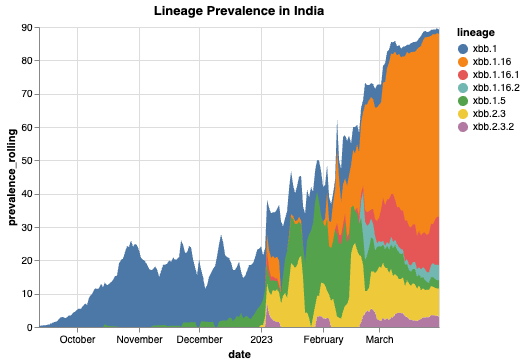
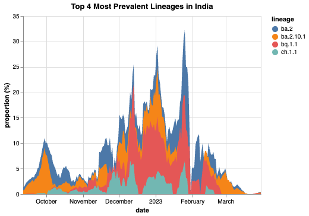

Lineage Prevalence Analysis
-----------------------------------------

The ``outbreak_data`` package has contains multiple endpoints that can collect information on SARS-CoV-2 lineages. Pulling data from a combination of endpoints will allow you to conduct your own analysis on the progression of SARS-CoV-2. On this page, you'll find a few example workflows that demonstrate how to collect, manipulate, and visualize prevalence data in SARS-CoV-2 lineages.

Here is how we would go about collecting data to find all the XBB lineages prevalent in India within a 1-year timeframe::

      # Perform authentication if you haven't already
      from outbreak_data import authenticate_user
      authenticate_user.authenticate_new_user()

      # Import outbreak_data package
      from outbreak_data import outbreak_data as od

      # Get the prevalence of all circulating XBB lineages in India
      data = od.prevalence_by_location("IND", startswith = 'xbb')
      # multiply prevalence values by 100% for scale
      data['prevalence_rolling'] = data['prevalence_rolling'].apply(lambda x: x*100)
      # Search for data based on date range
      data = data.sort_values(by="date")
      data = data.loc[data["date"].between("2020-09-12", "2022-03-31")]

      ## Use the visual package of your choice to create an area graph using your data
      import altair as alt

      # Graph of results
      alt.Chart(data, title = "Lineage Prevalence in India").mark_area().encode(
      x='date:T',
      y=alt.Y('prevalence_rolling:Q'),
      color = 'lineage:N')

.. code-block::
   :caption: Output:
    
               date  total_count  lineage_count     lineage  prevalence  \
    3014 2022-09-12            0              0    xbb.1.16    0.000000   
    3781 2022-09-12            0              0     xbb.2.3    0.000000   
    2593 2022-09-12          152              2       xbb.1    0.013158   
    3782 2022-09-13            0              0     xbb.2.3    0.000000   
    3015 2022-09-13            0              0    xbb.1.16    0.000000   
    ...         ...          ...            ...         ...         ...   
    4086 2023-03-31          196              2   xbb.2.3.2    0.010204   
    3322 2023-03-31          196             29  xbb.1.16.1    0.147959   
    2793 2023-03-31          196              1       xbb.1    0.005102   
    3381 2023-03-31          196              7  xbb.1.16.2    0.035714   
    3981 2023-03-31          196             15     xbb.2.3    0.076531   

         prevalence_rolling  
    3014            0.000000  
    3781            0.000000  
    2593            0.003451  
    3782            0.000000  
    3015            0.000000  
    ...                  ...  
    4086            0.031184  
    3322            0.144578  
    2793            0.014174  
    3381            0.045358  
    3981            0.084337  
   [985 rows x 6 columns]

.. note:: The `Vega-Altair <https://altair-viz.github.io/index.html>`_ visualization package is used for demonstration purposes.         However, any Python visual package can be used to create graphical representations of the data.

**Finding the Most Prevalent Lineages**
 
If we wanted to determine and plot the top four most prevalent lineages in India, we can make a few queries and use a few simple commands to create a table that shows us what these lineages are::

    data=od.prevalence_by_location("IND")
    most_prev = data.groupby('lineage').apply(max) # Finds the lineages with the most hits
    most_prev = most_prev.mask(most_prev == '').dropna(how = 'any') # Drop any unknowns
    most_prev = most_prev.iloc[:4]
    print(most_prev)

.. code-block::
   :caption: Output

                     date  total_count  lineage_count    lineage  prevalence  \
    lineage                                                                    
    ba.2       2023-04-20         5668           1445       ba.2    0.822785   
    ba.2.10.1  2023-04-19         5668             93  ba.2.10.1    0.285714   
    bq.1.1     2023-03-27          402              7     bq.1.1    0.428571   
    ch.1.1     2023-02-13          119              4     ch.1.1    0.400000   

               prevalence_rolling  
    lineage                        
    ba.2                 0.677541  
    ba.2.10.1            0.095541  
    bq.1.1               0.156863  
    ch.1.1               0.066667  

Next we'll collect the prevalence data on each of the four lineages::

    # Retrieve the official data on the prevalences of these lineages using `daily_prev()`
    d1 = od.daily_prev('ba.2', "IND")
    d2 = od.daily_prev('ba.2.10.1', "IND")
    d3 = od.daily_prev('bq.1.1', "IND")
    d4 = od.daily_prev( 'ch.1.1', "IND")

    # Formatting for creating the graph
    d1['lineage'] = 'ba.2'
    d2['lineage'] = 'ba.2.10.1'
    d3['lineage'] = 'bq.1.1'
    d4['lineage'] = 'ch.1.1'

    # Group together data from each lineage
    data = pd.concat([d1, d2, d3, d4])
    data = data.rename(columns = {'proportion': 'proportion (%)'})

    #Pick a date range to analyze
    data = data.sort_values(by="date")
    data = data.loc[data["date"].between("2022-09-12", "2023-03-31")]
    # Increase prevalence by 100%
    data['proportion'] = data['proportion'].apply(lambda x: x*100)
   
    #Graph using preferred visual package
    import altair as alt
    alt.Chart(data, title = "Top 4 Most Prevalent Lineages in India").mark_area().encode(
    x='date:T',
    y=alt.Y('proportion (%):Q'),
    color = 'lineage:N')

